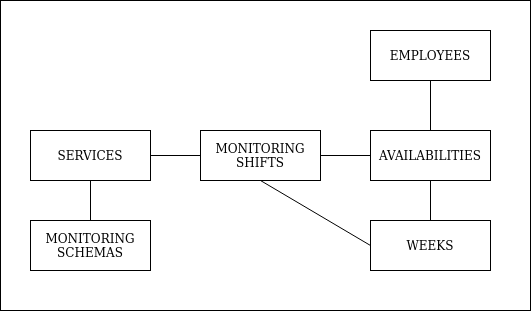

# README

## Dependencies

* Ruby version: 2.7.0.

* Run `bundle install` to install application dependencies.

* Database included as a sqlite file.

* Run `rake db:setup` to create the databases and load seeds.

* Run test suite with `bundle exec rspec`

## Domain Model



`availabilities` has references to both Employees and Weeks, but the days and hours in which an Employee is available are stored as integers. Note: The `day` field represents the index of that day of the week.

| id | week_id | employee_id | day | hour |
| -- |:-------:|:-----------:|:---:| ----:|
| 1  |  2      | 1           | 0   | 23   |

This means that in the **second week**, the **Employee with ID 1** can work on **Monday** (index 0) at **23:00** hours.

### Note

The `monitoring_schemas` table has a `JSON` field named `structure`. This field stores the schedule delivered by a client for their service to be monitored. This schedule is a hash, in which the keys represents a day of the week by its index, and the values are arrays that represent a range of hours of the day.

For example:
```
  {
    0 => [19, 20, 21, 22, 23],
    1 => [19, 20, 21, 22, 23],
    2 => [19, 20, 21, 22, 23],
    3 => [19, 20, 21, 22, 23],
    4 => [19, 20, 21, 22, 23],
    5 => [6, 7, 8, 9, 10],
    6 => [6, 7, 8, 9, 10]
  }
```

This structure states that from Monday to Friday a service needs to be monitored between 19 hours and midnight, and the weekend the serivice needs to be monitored from 6 AM to 11 AM.

A similar thing applies to the `structure` field for a `monitoring_shit`. This field stores the confirmated monitoring schedule of a service in a particular week. Monitoring schedule is represented on a structure like the following:

```
  {
    0 => {
      19 =>1,
      20 =>1,
      21 =>1,
      22 =>2,
      23 =>2
    }
    ...
  }
```

Using the `monitoring_schema` shown at the beginning, this structure states that the Monday of that week the shift from 19 hours to 22 hours will be in charge of the Employee with ID 1, and the second shift, from 22 hours to midnight, will be in charge of the Employee with ID 2.


## Assessment Assumptions

1. Any Employee can be assigned to the Monitoring Shift of any Service.
2. A Service can only have one Monitoring Schema.
3. It is assumed that all Weeks start on a Monday.
4. Maintainers for Employees, Services, Weeks, and Monitoring Schemas were not considered in the development of the MVP.
