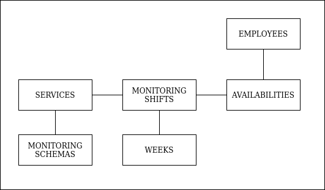

# README

## Dependencies

* Ruby version: 2.7.0.

* Run `bundle install` to install application dependencies.

* Database included as a sqlite file.

* Run `rake db:setup` to create the databases and load seeds.

* Run test suite with `bundle exec rspec`

## Domain Model

## Assessment Assumptions

1. Any Employee can be assigned to the Monitoring Shift of any Service.
2. Employees availability is always the same.
3. A Service can only have one Monitoring Schema.
4. It is assumed that all Weeks start on a Monday.
5. Mantainers for Employees, Services, Weeks and Monitoring Schemas were not considered in the development of the MVP.
